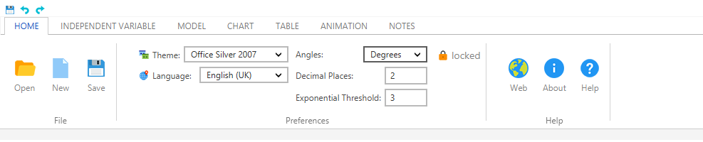

# FXRibbon
Ribbon control for Java, using JavaFX framework, based on [Microsoft Ribbon](https://en.wikipedia.org/wiki/Ribbon_(computing)).
If you want to support the development of this library consider a [donation or sponsoring a feature or bug fix](http://www.pixelduke.com/contact).

## Documentation
For more information check [http://www.pixelduke.com/fxribbon](http://www.pixelduke.com/fxribbon)

## How to get the library
- If you just want to download the jar file containing the library go to [releases tab](https://github.com/dukke/FXRibbon/releases).
- If you want to use maven the jar is available through [Bintray](https://bintray.com/dukke/maven/FXRibbon).

Please send me pictures of your application that is using FXRibbon, this is for me to know how users are effectively using
it and make adjustments accordingly and if you allow it, to showcase example uses.

## Issues and Contributions
Issues can be reported to the Issue tracker. If you're not sponsoring or fixing them yourself, please be patiente as I can only work on them during my spare time and according to priorities.  
We welcome contributions, they can be submitted via Pull requests.

## Pull Requests (PR)
We welcome contributions via PR.  
Before submitting a PR please, please file an issue for prior discussion. This will avoid you wasting time with a PR that
might not be approved because for instance might be outside the intended scope of the project.

## Controls used inside Ribbon
The controls used inside the ribbon (e.g. comboboxs, texfield, etc)  are based on JMetro, visit [http://www.pixelduke.com/jmetro](http://www.pixelduke.com/jmetro)
for more information.  
For now the option has been to, for the most commonly used controls inside the ribbon, have these styles available through this library and so avoid another dependency for most use cases. 

## Icons used on test apps
Kudos icons8 for the icons used in the sample apps, visit [https://icons8.com](https://icons8.com) for more information.

## About The Author
I hope you don't mind just a bit of publicity. I'm a [JavaFX and Swing Freelancer and Consultant](https://www.pixelduke.com), a
Software Engineer and Software Designer with experience in User Interface Design and User Experience. If you need to hire
professional assistance feel free to [contact me](https://www.pixelduke.com/contact).  
Still, this is, and will remain being, a free and open source library, so feel free to use it.

# License
FXRibbon uses the [new BSD](http://en.wikipedia.org/wiki/BSD_licenses#3-clause_license_.28.22Revised_BSD_License.22.2C_.22New_BSD_License.22.2C_or_.22Modified_BSD_License.22.29) license 
